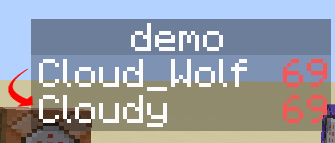

# Player-Name-Tracker
A minecraft datapack for detecting player name changes and updating scoreboards accordingly, using macros.
<!-- ALL-CONTRIBUTORS-BADGE:START - Do not remove or modify this section -->

<!-- ALL-CONTRIBUTORS-BADGE:END -->

## How it Works 💡
<!-- prettier-ignore-start -->
<!-- markdownlint-disable -->
This repo provides a datapack for detecting player name changes, allowing you to update important scoreboards accordingly. For example, if you store the player's level on a scoreboard they will lose their level when they change their name. This pack is a very lightweight implementation and contains 1 scoreboard, 1 text_display entity (which should be in spawn chunks), and only performs 2 ticking score checks. If a new player joins the server it will add them to a storage database and anytime a user reconnects it performs a query to see if their name has changed.
<!-- markdownlint-enable -->
<!-- prettier-ignore-end -->

## How to Use 📝
<!-- prettier-ignore-start -->
<!-- markdownlint-disable -->

1. Add the datapack to your world or namespace
2. Open the mcfunction named "scorelist" under functions/new_name
3. Add lines to specify how scoreboards should be handled. $(old_name) is the player's old name and @s is the player. I also recommend resetting the old name to prevent possible overlap.

<!-- markdownlint-enable -->
<!-- prettier-ignore-end -->

## Contributors 🧱
<!-- prettier-ignore-start -->
<!-- markdownlint-disable -->
<table>
  <tr>
    <td align="center"><a href="https://github.com/CloudWolfYT"> <b>Cloud Wolf</b></a> <a href="#" title="Project Creator">🔨</a></td>
  </tr>
</table>

<!-- markdownlint-enable -->
<!-- prettier-ignore-end -->
